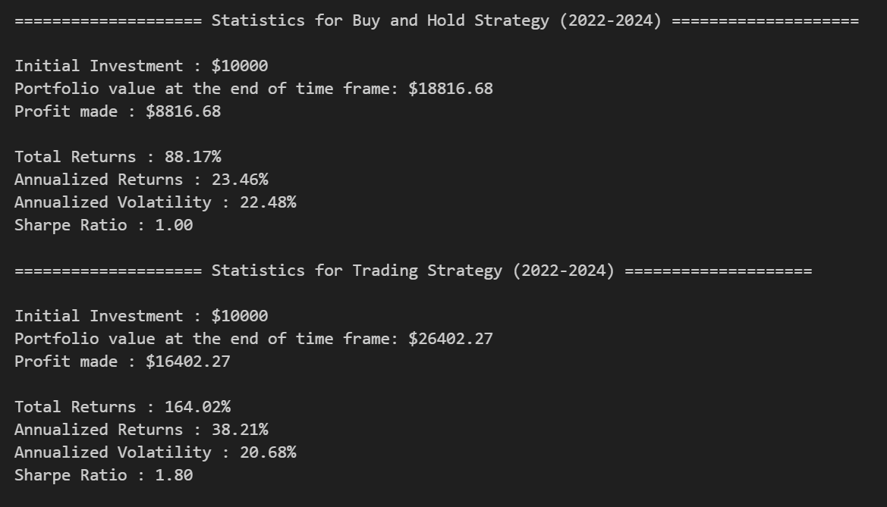

# Clustering-Based Financial Strategies: Pair Trading and Portfolio Optimization

### Objectives: 

    1. Leverages clustering techniques to enhance pair trading and portfolio optimization.
    2. Clusters assets with similar characteristics using historical price data.
    3. Selects highly correlated pairs for trading and ensures diversified asset selection.
    4. Applies Markowitz Mean-Variance Optimization framework to determine optimal asset weights.
    5. Visualizes data, analyzes clusters, monitors trading performance, and assesses portfolio returns.
    6. Provides a robust tool for informed financial decision-making.

## Results:

#### 1. On the portfolio constructed using selected tickers, for an initital investment of 10000$, buy-and-hold strategy generated a profit of 20000$ and the proposed trading strategy generated a profit of 20000$

 

#### 2. Statistics of the portfolio for buy-and-hold strategy and proposed trading strategy

 

## Methodology:  

#### 1.  

 
