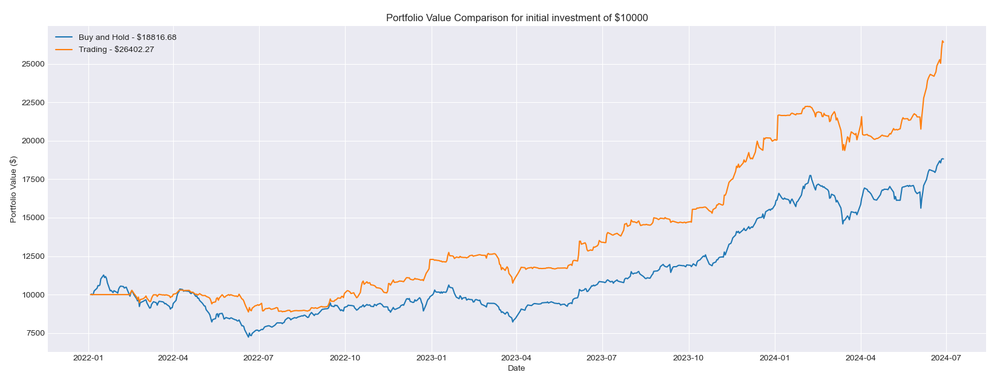
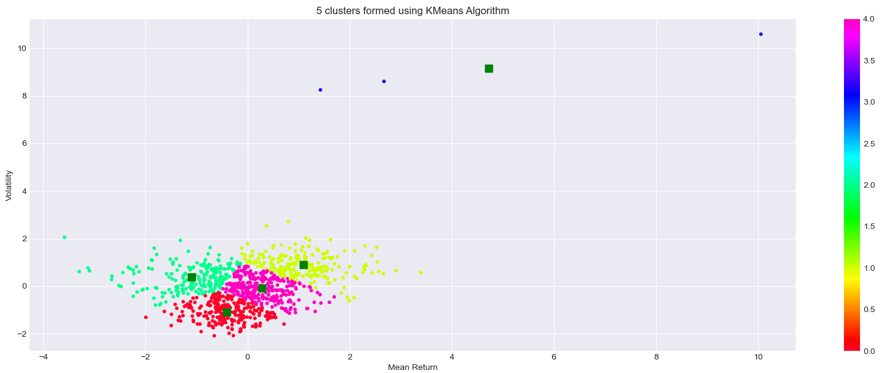
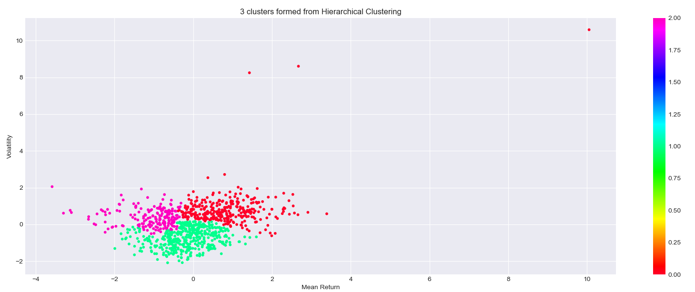
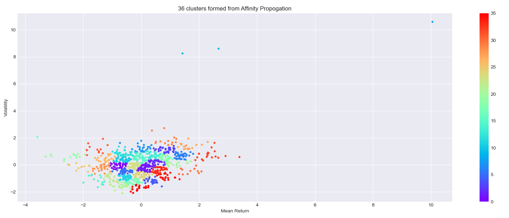
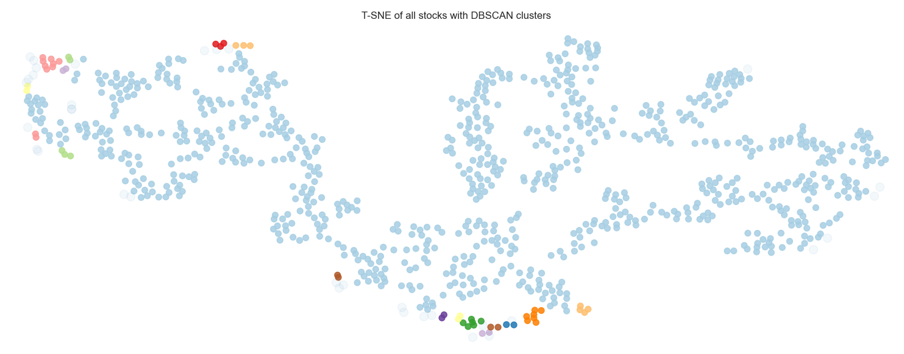
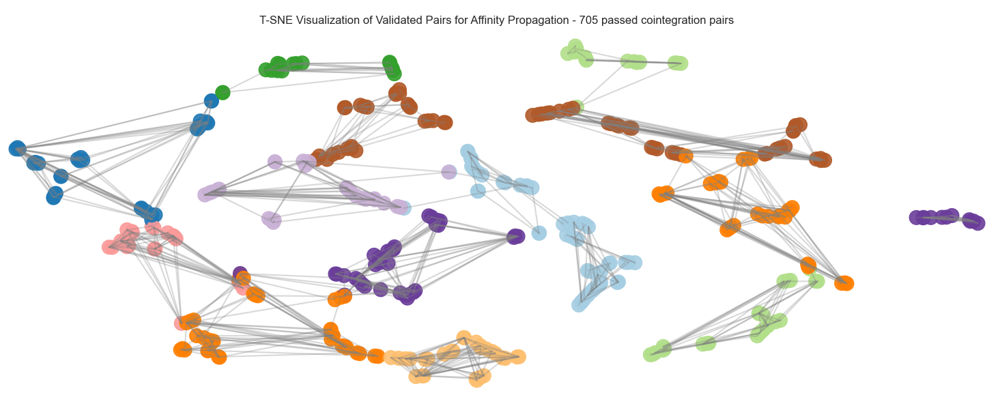
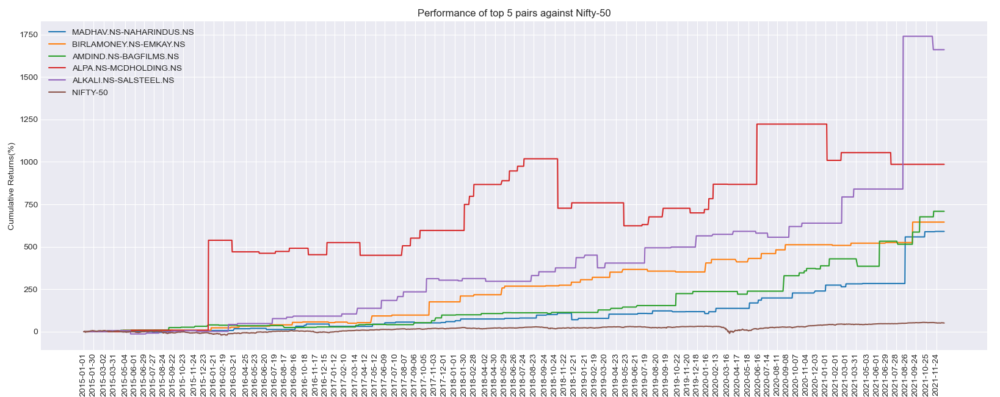
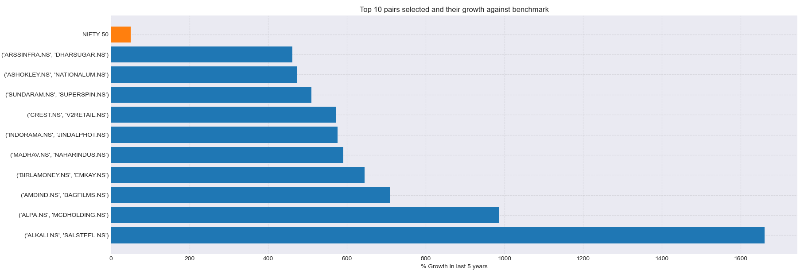
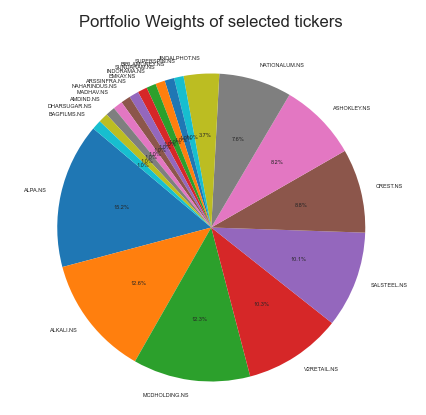
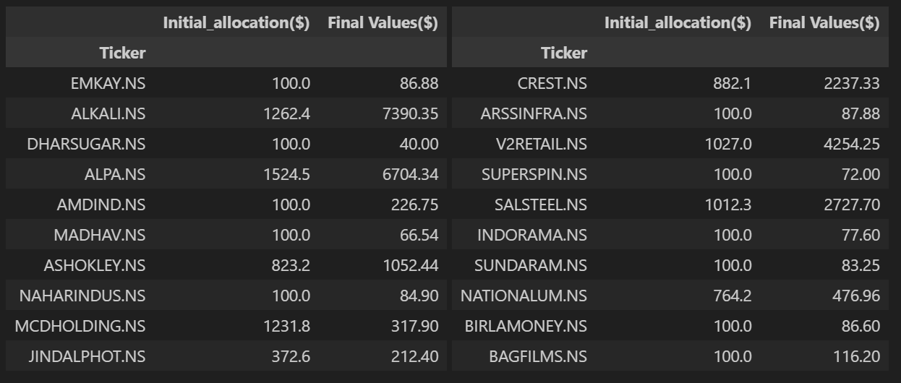

# Clustering-Based Financial Strategies: Pair Trading and Portfolio Optimization

### Objectives: 

    1. Leverages clustering techniques to enhance pair trading and portfolio optimization.
    2. Clusters assets with similar characteristics using historical price data.
    3. Selects highly correlated pairs for trading and ensures diversified asset selection.
    4. Applies Markowitz Mean-Variance Optimization framework to determine optimal asset weights.
    5. Visualizes data, analyzes clusters, monitors trading performance, and assesses portfolio returns.
    6. Provides a robust tool for informed financial decision-making.

## Results:

#### 1. On the portfolio constructed using selected tickers, for an initital investment of $10000, buy-and-hold strategy generated a profit of $15028.38 and the proposed trading strategy generated a profit of $21961.48

 
 

#### 2. Statistics of the portfolio for buy-and-hold strategy and proposed trading strategy
 

 

## Methodology:  

#### 1. Various clustering algorithms, including KMeans, Hierarchical, Affinity Propagation, and DBSCAN, were utilized for asset clustering. Clustering of assets are done based on returns and volatility of each asset. 

 

 

#### 2. Based on the silhouette score and the number of clusters formed, `Affinity Propagation` was chosen as the optimal clustering method.

#### 3. From the assets in the clusters formed by Affinity Propagation, 705 pairs successfully passed the cointegration test.

  

#### 4. Plotting top 5 pairs and top 10 pairs outperforming the benchmark were selected for further analysis.

  
  

#### 5. From each of these pairs, one asset was chosen based on its expected returns.

#### 6. A portfolio was constructed using the selected assets' data from 2015 to 2021, with asset weights determined by Markowitz Portfolio Theory.

   

#### 7. Allocation of capital before and after trading for each asset

   

#### 8. For an investment of $10,000 in this portfolio over approximately two years (2022-2024), a buy-and-hold strategy generated a portfolio value of $15028.38, while the developed trading strategy resulted in a portfolio value of $21961.48. 

 

